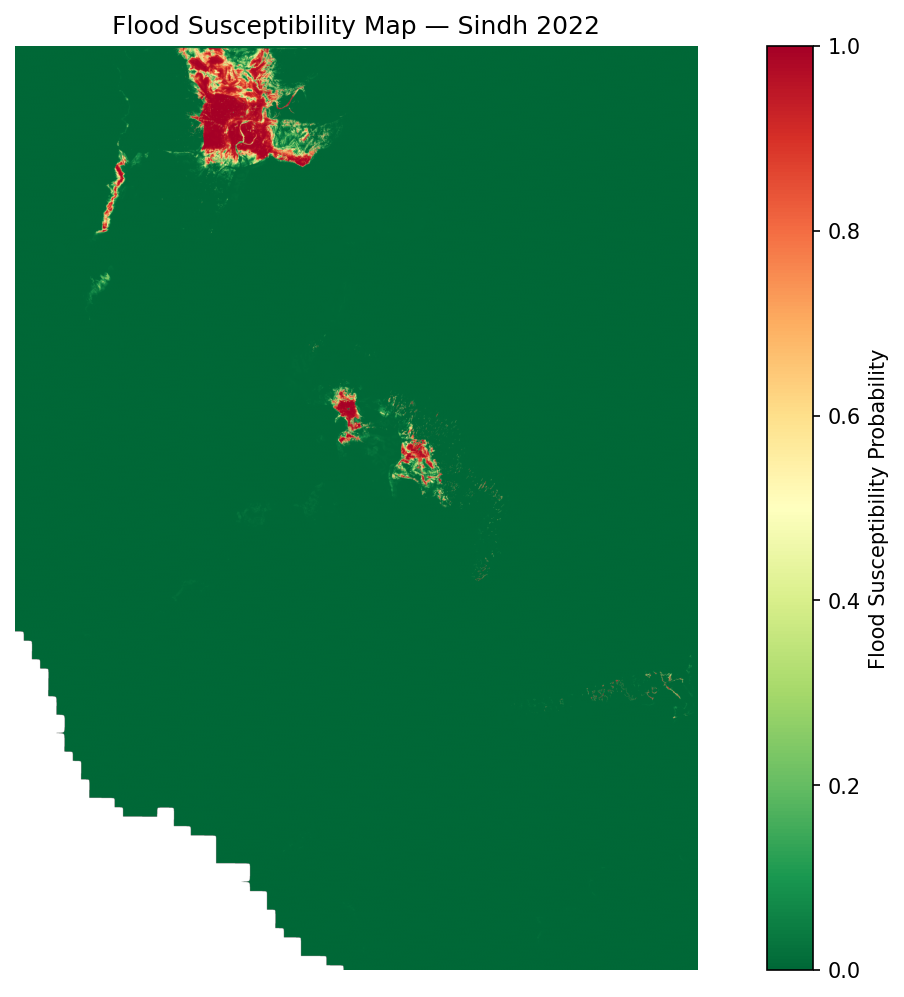

# Flood Susceptibility Mapping of Sindh Province, Pakistan

A machine learning pipeline that maps flood susceptibility across Sindh Province using **XGBoost** and freely available satellite and geospatial data. The case study is the **August 2022 monsoon floods**.

**[Live demo](https://flood-susceptibility-mapping.vercel.app/)**



## Overview

The 2022 monsoon floods submerged roughly one-third of Pakistan, and Sindh was among the worst-hit provinces. This project predicts, for every 30 m pixel, how likely the terrain is to flood, producing a continuous susceptibility surface that can support disaster preparedness, land-use planning and emergency response.

- End-to-end, reproducible pipeline run from a single entry point (`run.py`)
- Uses open data only, with no commercial licences
- Flood labels derived from Copernicus EMS satellite-observed inundation polygons
- Spatial block train/test split to limit spatial-autocorrelation leakage
- Interactive dashboard, run locally or deployed publicly on Vercel

## Results

Test set of 125,000 held-out pixels:

| Metric | Value |
|---|---|
| AUC-ROC | 0.9984 |
| Average precision | 0.9856 |
| Overall accuracy | 98.86% |
| Flood precision | 0.9255 |
| Flood recall | 0.9987 |
| Flood F1-score | 0.9607 |

Only 23 of 17,508 flooded test pixels were missed. High susceptibility concentrates along the Indus floodplain, notably the Larkana-Sukkur-Jacobabad corridor and around Sanghar and Khipro, matching the observed 2022 flood extents.

> **Interpret with care:** the very high AUC may be inflated by residual spatial autocorrelation even with block splitting. Treat this as an MVP baseline, not proof of generalisation to other flood events.

## Data

| Dataset | Source | Resolution | Role |
|---|---|---|---|
| Copernicus DEM 30 m | ESA / AWS open-data registry | 30 m | Elevation, slope, TWI |
| CHIRPS-2.0 pentads | UCSB Climate Hazards Center | ~5.5 km | Peak and cumulative rainfall |
| HydroRIVERS v10 | HydroSHEDS / WWF | Vector | Distance to river |
| Copernicus EMS EMSR629 / EMSR631 | EU EMS Rapid Mapping | Vector polygons | Flood-extent ground truth |
| ESA WorldCover 2021 | ESA / Zenodo | 10 m | Land cover (placeholder in MVP) |

**Predictors (7):** elevation, slope, Topographic Wetness Index (TWI), distance to river, land cover, peak pentad rainfall, cumulative rainfall.

All layers are reprojected to UTM Zone 42N (EPSG:32642) on a 6,170 x 4,556 pixel, 30 m grid (~28.1 million pixels).

## Pipeline

The pipeline has four stages, each run through `run.py`:

| Stage | Command | What it does |
|---|---|---|
| 1. Data acquisition | `python run.py download` | Downloads the DEM tiles (anonymous AWS S3), CHIRPS pentads, HydroRIVERS and imports EMS data |
| 2. Feature engineering | `python run.py process` | Aligns rasters to the DEM grid; derives slope, TWI, river distance and rainfall aggregates; rasterises labels |
| 3. Model training | `python run.py train` | Spatial block split, XGBoost training, evaluation, full-region inference |
| 4. Dashboard | `python run.py dashboard` | Launches the local Streamlit + Folium dashboard |

Terrain derivatives are computed with [WhiteboxTools](https://github.com/jblindsay/whitebox-tools). Class imbalance (only 0.25% of pixels are flooded) is handled by keeping all 71,108 flood pixels, sampling 428,892 non-flood pixels, and setting `scale_pos_weight`.

## Repository structure

```
.
├── data/              # Raw and processed datasets, model outputs
├── deploy/            # Assets served by the public deployment
├── src/               # Pipeline source code
├── app.py             # Flask + Leaflet web app (Vercel deployment)
├── config.py          # Paths and pipeline configuration
├── prepare_deploy.py  # Downsamples the risk raster for web deployment
├── run.py             # Command-line entry point for all pipeline stages
├── requirements.txt   # Python dependencies
├── pyproject.toml     # Project metadata for deployment
├── vercel.json        # Vercel configuration
└── .gitignore
```

## Getting started

### Prerequisites

- Python 3.10+
- Roughly 20 GB of free disk space for the raw rasters and the full-resolution risk raster

### Installation

```bash
git clone https://github.com/maryamimambux/flood-susceptibility-mapping.git
cd flood-susceptibility-mapping
python -m venv .venv
source .venv/bin/activate        # Windows: .venv\Scripts\activate
pip install -r requirements.txt
```

### Run the pipeline

```bash
python run.py download
python run.py process
python run.py train
python run.py dashboard
```

The local dashboard offers layer toggles (risk map, observed flood extent, rainfall, river network), an adjustable risk-threshold slider, and a click-to-analyse panel showing predicted risk and contributing factors at any location.

## Deployment

The public site is a lightweight Flask + Leaflet app served as a serverless function on [Vercel](https://vercel.com). The full risk raster (~957 MB) is far too large for serverless limits, so `prepare_deploy.py` produces a downsampled 309 x 228 version (~575 KB JSON) that is drawn as a canvas image overlay on the map.

```bash
python prepare_deploy.py   # regenerate the downsampled risk layer
vercel --prod              # deploy
```

## Feature importance

| Feature | Approx. share of gain |
|---|---|
| Peak pentad rainfall | 35% |
| Elevation | 27% |
| Cumulative rainfall | 26% |
| Slope | 8% |
| TWI | 2-3% |
| Distance to river | 2-3% |
| Land cover | ~0% (constant placeholder) |

## Limitations

- **Single-event training:** trained only on August 2022, so it may not transfer to floods with different mechanisms.
- **Susceptibility, not forecasting:** estimates static propensity, with no flood-wave propagation or temporal dynamics.
- **Land-cover placeholder:** real ESA WorldCover data is not yet integrated.
- **Coarse rainfall:** CHIRPS pentads (~5.5 km) are coarse relative to the 30 m grid.
- **Partial ground truth:** EMS delineations cover five areas of interest; flooded areas outside them are labelled non-flood.

## Roadmap

- [ ] Integrate ESA WorldCover 2021 land cover
- [ ] Multi-event training (2010, 2011, 2020, 2023)
- [ ] Add Sentinel-1 SAR flood extents for cloud-independent ground truth
- [ ] Hyperparameter optimisation and SHAP-based interpretability
- [ ] Calibrate probabilities against return-period hazard maps

## References

1. European Commission. *Copernicus Emergency Management Service - Rapid Mapping*, EMSR629 and EMSR631 (Pakistan Floods, 2022).
2. European Space Agency. *Copernicus DEM, 30 m*. AWS Registry of Open Data.
3. Funk, C., et al. (2015). The climate hazards infrared precipitation with stations. *Scientific Data*, 2, 150066.
4. Lehner, B., et al. (2008). New global hydrography derived from spaceborne elevation data. *Eos*, 89(10), 93-94.
5. Chen, T., and Guestrin, C. (2016). XGBoost: A scalable tree boosting system. *Proc. ACM SIGKDD*, 785-794.
6. Lindsay, J. B. (2016). WhiteboxTools: A geospatial analysis toolkit.
7. Roberts, D. R., et al. (2017). Cross-validation strategies for data with temporal, spatial, hierarchical, or phylogenetic structure. *Ecography*, 40(8), 913-929.
8. CRED / UNDRR. (2022). *Pakistan Floods 2022 - Post-Disaster Needs Assessment*.

## License

Add a license of your choice (e.g. MIT) in a `LICENSE` file.
