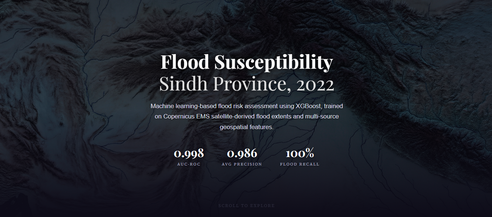

<div align="center">

# 🌊 Flood Susceptibility Mapping — Sindh, Pakistan

**Machine learning on open satellite data to show where the 2022 floods hit hardest, at 30 m resolution.**

[](https://flood-susceptibility-mapping.vercel.app/)
[](DOCUMENTATION/Flood_Susceptibility_Report.pdf)


</div>

<a href="https://flood-susceptibility-mapping.vercel.app/">
  
</a>

<p align="center"><sub>👆 Click the screenshot to open the live map</sub></p>

---

## ⚡ At a glance

| | |
|---|---|
| 🎯 **AUC-ROC** | **0.998** |
| 🔎 **Flood recall** | **99.87%** (23 of 17,508 flooded pixels missed) |
| 🗺️ **Resolution** | **30 m**, ~28 million pixels covering ~225,000 km² |
| 🧠 **Training data** | 500,000 pixels labelled from Copernicus EMS satellite flood polygons |
| 💸 **Data cost** | **$0**: 100% open data |
| 🌐 **Deployed** | Interactive web map on Vercel |

## ✨ What makes this project stand out

- **End-to-end ownership:** data download → feature engineering → model → dashboard → public deployment, all from one CLI (`python run.py <stage>`).
- **Real-world, high-stakes problem:** the 2022 monsoon floods affected 33 million people in Pakistan.
- **Handles hard data problems:** only 0.25% of pixels are flooded, so I used class-balanced sampling and `scale_pos_weight`.
- **Methodologically careful:** a **spatial block split** instead of a random one to limit leakage, plus an honest limitations section that flags possible metric inflation.
- **Production-minded engineering:** the 957 MB risk raster was downsampled to a ~575 KB payload so it runs as a serverless web app.
- **Fully reproducible:** anonymous S3 downloads with resume support and tile integrity checks.

## 🎮 Try it

1. **[Open the live map](https://flood-susceptibility-mapping.vercel.app/)**, pan, zoom and jump between cities.
2. **Run the full dashboard locally** for more controls:
   - Toggle layers: risk map, observed flood extent, rainfall, river network
   - Move the **risk-threshold slider**
   - **Click anywhere** to see predicted risk and the factors driving it

```bash
git clone https://github.com/maryamimambux/flood-susceptibility-mapping.git
cd flood-susceptibility-mapping
pip install -r requirements.txt
python run.py dashboard
```

## 🔬 How it works


| Stage | Command |
|---|---|
| 1. Data acquisition | `python run.py download` |
| 2. Feature engineering | `python run.py process` |
| 3. Model training and inference | `python run.py train` |
| 4. Dashboard | `python run.py dashboard` |

<details>
<summary><b>📊 Full performance metrics (click to expand)</b></summary>

<br>

Test set of 125,000 held-out pixels:

| Metric | Value |
|---|---|
| AUC-ROC | 0.9984 |
| Average precision | 0.9856 |
| Accuracy | 98.86% |
| Flood precision | 0.9255 |
| Flood recall | 0.9987 |
| Flood F1-score | 0.9607 |

|  | Predicted: not flooded | Predicted: flooded |
|---|---|---|
| **Actual: not flooded** | 106,084 | 1,408 |
| **Actual: flooded** | 23 | 17,485 |

</details>

<details>
<summary><b>🌍 Data sources (click to expand)</b></summary>

<br>

| Dataset | Source | Role |
|---|---|---|
| Copernicus DEM 30 m | ESA / AWS | Elevation, slope, TWI |
| CHIRPS-2.0 pentads | UCSB Climate Hazards Center | Peak and cumulative rainfall |
| HydroRIVERS v10 | HydroSHEDS / WWF | Distance to river |
| Copernicus EMS EMSR629 / 631 | EU Rapid Mapping | Flood ground truth |
| ESA WorldCover 2021 | ESA / Zenodo | Land cover (placeholder in MVP) |

</details>

<details>
<summary><b>📈 What drives the predictions (click to expand)</b></summary>

<br>

| Feature | Approx. share of gain |
|---|---|
| Peak pentad rainfall | 35% |
| Elevation | 27% |
| Cumulative rainfall | 26% |
| Slope | 8% |
| TWI | 2-3% |
| Distance to river | 2-3% |
| Land cover | ~0% (placeholder) |

</details>

<details>
<summary><b>⚠️ Honest limitations (click to expand)</b></summary>

<br>

- The very high AUC may be inflated by residual spatial autocorrelation, so treat this as an MVP baseline.
- Trained on a single event (August 2022) and may not transfer to other flood types.
- Estimates susceptibility, not real-time forecasts.
- Land cover is a constant placeholder until ESA WorldCover is integrated.
- CHIRPS rainfall (~5.5 km) is coarse relative to the 30 m grid.
- EMS ground truth covers five areas, so unobserved flooded areas are labelled non-flood.

</details>

<details>
<summary><b>🗂️ Repository structure (click to expand)</b></summary>

<br>

```
.
├── DOCUMENTATION/     # Full report (PDF) and figures
├── data/              # Datasets and model outputs
├── deploy/            # Assets for the public deployment
├── src/               # Pipeline source code
├── app.py             # Flask + Leaflet web app
├── config.py          # Configuration
├── prepare_deploy.py  # Downsamples the risk raster for the web
├── run.py             # CLI entry point
├── requirements.txt
├── pyproject.toml
└── vercel.json
```

</details>

## 📚 Detailed documentation

The full write-up covers the study area, methodology, results, discussion and references:

👉 **[`DOCUMENTATION/Flood_Susceptibility_Report.pdf`](DOCUMENTATION/Flood_Susceptibility_Report.pdf)**

## 🛣️ Roadmap

- [ ] Integrate real ESA WorldCover land cover
- [ ] Multi-event training (2010, 2011, 2020, 2023)
- [ ] Sentinel-1 SAR flood extents
- [ ] SHAP interpretability and hyperparameter tuning
- [ ] Probability calibration against return-period hazard maps

---

<div align="center">

Built with open data from Copernicus, CHIRPS and HydroSHEDS.
If you find this useful, a ⭐ is appreciated.

</div>
